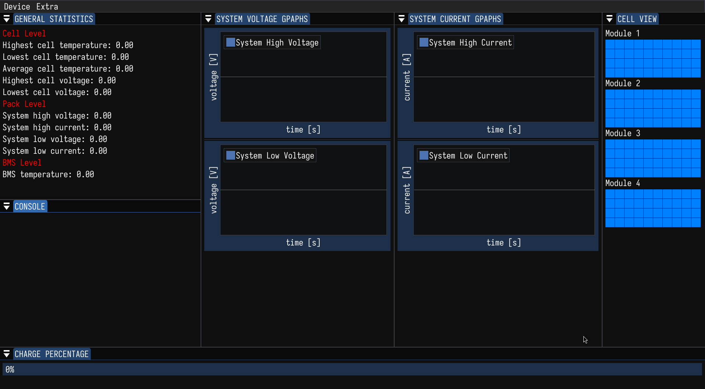

# BMSUI

Battery management system UI. This program reads input from the BMS via an
USB-adaptor and displays the data on a graphical user interface. This project is
my attempt at assignment for the Software Programmer position at
[TDSR](www.solarracing.nl).

Because the original assignment didn't provide any datasets or access to the
physical BMS, a simple data simulator was created in util. Please see
[usage](#Usage) for choosing either the simulator or the actual device.

Note that at the moment of making this assignment, it is tested on linux
only. Besides tools and requirements are available on linux, but might require
some tweakering or WSL on windows.

# Requirements

On Linux/Debian (Wayland/X11) use the following command to install all the prerequisites:
```bash
$ apt install libwayland-dev libxkbcommon-dev xorg-dev build-essential make libgl1-mesa-dev cmake libwayland-bin wayland-protocols libxrandr-dev libxinerama-dev socat python3 curl
$ curl -LsSf https://astral.sh/uv/install.sh | sh
```

If you have NVIDIA graphics card and Linux, make sure you have working drivers.
On Debian, refer to [Debian NVIDIA
manual](https://wiki.debian.org/NvidiaGraphicsDrivers).

# Installation

To install use the following commands:

```bash
$ cd path/to/your/preferred/directory
$ git clone https://github.com/horki-at/bmsui.git
$ cd bmsui
$ ./configure.sh
# To install system-wise:
$ sudo -E make install -j16
# To install user-wide:
$ make install -j16
# To install system-wide:
$ sudo -E make install -j16
```

# Usage

## Welcome screen

After starting the app, you will be welcome with the inactive program:


There are a couple of modules, each with its own information. If you don't like
the layout, you can re-arrange the panels and the new layout will be preserved
in the future uses. Modules functionalities are:

1. **General Statistics** presents min/max/average values of temperatures,
   voltages, and currents on the cell and pack levels. It also presents average
   BMS temperature measured by the four sensors.
2. **Console** is a way for a program to communicate with the user. It logs
   errors, warnings (currently, this is a todo item), and other program-level
   information. It can be disabled by hiding the console.
3. **Charge percentage** represents the state of charge of the battery pack.
4. **Graphs** present the time-domain of high/low voltage and current. By
   right-clicking on each graph, you can change their views, display ticks and
   marks. etc.
5. **Cell view** is a grid of modules and corresponding cells of the entire
   battery pack. Hovering on a cell gives you information about that cell's
   individual temperature and voltage. Note that because there are only 48
   temperature sensors, close-by cells happen to have the same temperature
   (because only one sensor measures multiple cells). If cell's temperature
   becomes greater that its operating temperature, the cell color becomes
   redder.
   
## Connecting the device

At the moment of development, I didn't have access to the real battery therefore
the program cannot yet auto-detect the BMS device. Hence
Device/Open_real\_device does't work yet. Instead a simple simulation of a real
battery can be launched in the Device menu. After clicking there, you will be
presented with another Simulation module where you can either disconnect the
battery from everything (idle mode), charge it with the set current, or
discharge it at a certain load resistance.


Note that the simulation is set to work at 100Hz (100 data-samples per second).

# Further TODOs

Because this is an early version 1, it still doesn't have everything that I
would want because of the time constraints. Here I list some the things that the
program might benefit from:
- [ ] A better simulation model for the battery pack (e.g., not a first-degree
      order model, better cell-to-cell temperature interaction)
- [ ] Module to fully customize the simulation from within the
      application. (e.g., customize the actual battery pack module/cell
      configuration, or set ambient information by hand)
- [ ] Ability to store/load the records from a local database for future
      re-examination or presentation (might be sqlite or some custom binary
      file)
- [ ] Ability to specify the order of UART data received from BMS. Right now it
      is hardcoded into one of the extractor operators in BMS.
- [ ] Make this program cross platform (Windows), and list prerequisites-install
      commands for other linux distributions.
- [ ] (less important) Display the 3D model of the battery pack for visual
      aesthetics.

# References

- The Art of Electronics by Horowitz et al.
- Aaron Danner youtube channel for electronics
- Wikipedia Sherman-Morrison formula
- Wikipedia Millman's theorem
