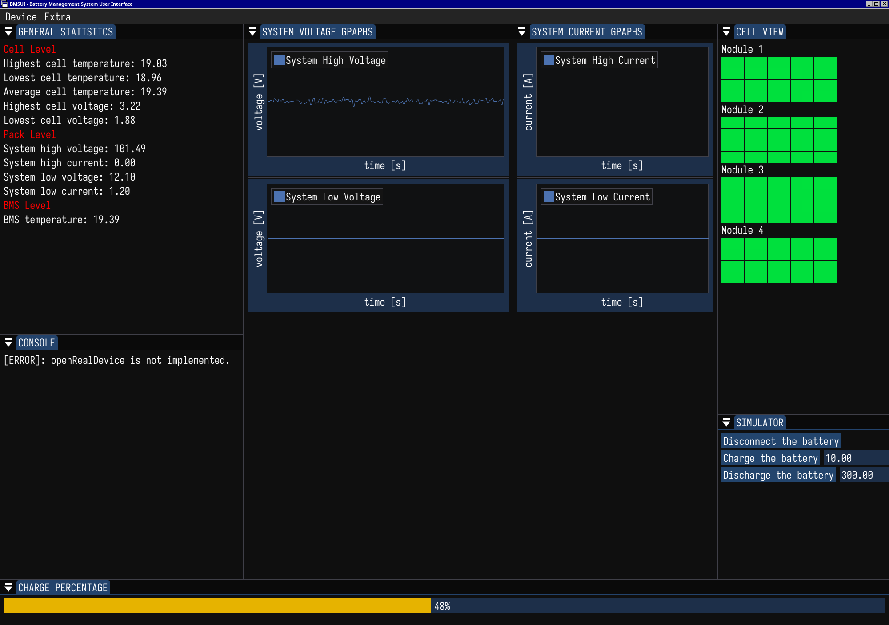

# BMSUI

<p align="center"></p>

## Introduction

BMSUI is a GUI monitoring application for a battery management system (BMS). It
reads data via UART from either a physical device (connected to the laptop via a
USB adaptor), or from a first-order simulator. The GUI part is build using
OpenGL graphics API, GLFW3 for window management, and uses an immediate mode
graphics library (ImGui) for easier creation of widgets. The simulator is
written using a scripting language.

This project is my attempt at making the assignment for the software programmer
position at *Top Dutch Solar Racing* team.

Currently it is not possible to connect a real device because this functionality
cannot be adequately tested. This function is currently in the [todo
section](#Todo). Besides, the current version works only on linux because it
uses POSIX functions and GNU utilities for building, creating virtual devices,
and compiling. If you wish to use this program, you should install WSL Ubuntu.

## Requirements

On Linux/Debian (Wayland/X11) use the following command to install all the prerequisites:
```bash
$ apt install libwayland1-dev libxkbcommon-dev xorg-dev build-essential make libgl1-mesa-dev cmake libwayland-bin wayland-protocols libxrandr-dev libxinerama-dev socat python3 curl sed
$ curl -LsSf https://astral.sh/uv/install.sh | sh
```

If you have NVIDIA graphics card and Linux, make sure you have working drivers.
On Debian, refer to [Debian NVIDIA
manual](https://wiki.debian.org/NvidiaGraphicsDrivers).

## Installation

To install use the following commands:

```bash
$ cd path/to/your/preferred/directory
$ git clone https://github.com/horki-at/bmsui.git
$ cd bmsui
$ ./configure.sh
# To install system-wise:
$ sudo -E make install -j16
# To install user-wide:
$ make install -j16
# To install system-wide:
$ sudo -E make install -j16
```

## Usage

### Welcome screen

After starting the app, you will be welcome with the inactive program:


There are a couple of modules, each with its own information. If you don't like
the layout, you can re-arrange the panels and the new layout will be preserved
in the future uses. Modules functionalities are:

1. **General Statistics** presents min/max/average values of temperatures,
   voltages, and currents on the cell and pack levels. It also presents average
   BMS temperature measured by the four sensors.
2. **Console** is a way for a program to communicate with the user. It logs
   errors, warnings (currently, this is a todo item), and other program-level
   information. It can be disabled by hiding the console.
3. **Charge percentage** represents the state of charge of the battery pack.
4. **Graphs** present the time-domain of high/low voltage and current. By
   right-clicking on each graph, you can change their views, display ticks and
   marks. etc.
5. **Cell view** is a grid of modules and corresponding cells of the entire
   battery pack. Hovering on a cell gives you information about that cell's
   individual temperature and voltage. Note that because there are only 48
   temperature sensors, close-by cells happen to have the same temperature
   (because only one sensor measures multiple cells). If cell's temperature
   becomes greater that its operating temperature, the cell color becomes
   redder.
   
### Connecting the device

At the moment of development, I didn't have access to the real battery therefore
the program cannot yet auto-detect the BMS device. Hence
Device/Open_real\_device does't work yet. Instead a simple simulation of a real
battery can be launched in the Device menu. After clicking there, you will be
presented with another Simulation module where you can either disconnect the
battery from everything (idle mode), charge it with the set current, or
discharge it at a certain load resistance.



Note that the simulation is set to work at 100Hz (100 data-samples per second).

## Architecture
TODO: doxygen comments and UML class diagram generation

### Short component-wise description

*DoubleFork* is a class responsible for managing a parent process that was
forked into two children processes. One can dispatch the children Tasks, kill
them, wait for them, and get their corresponding PIDs.

*Pipe* is a helper class that wraps several standard pipe-related POSIX
functions. It wraps a single pipe and provides methods to open, close both both
ends, close either a read or write end, and receive the either end.

*Simulator* handles the running, stopping, and interaction of the main
application and the simulator script. By running start(), the Simulator uses
DoubleFork utility class to create a socat process that mimics the real
transceiver (ttyVBMS) and the real receiver (ttyVAPP). The second process is the
populate_bms.py script that sends BMS data to ttyVBMS with a set frequency
(hardcoded at 100Hz). It provides methods to kill the simulation, check whether
it is running, retrieve ttyVBMS and ttyVAPP file paths, and to send commands to
the simulator script (see enum class Command) such as charge or discharge.

*Ring* is a thread-safe circular buffer used for more efficient communication
between the producer and consumer threads. If the ring is full, the producer has
to wait until notified that the ring is not full. The consumer can always
receive a value from the ring: either actual data, or std::nullopt (NULL) to
indiciate that the ring is empty. This choice was made because the monitoring
system should *not* skip any data and must always be responsive to the user.

*BMS* is the class that reads and parses BMS::Data from a stream. The stream can
be either that from the Simulator, or from a real device. In fact, because BMS
uses std::istream to receive the data, any input source can be used. This class
is also responsible for partial processing of the data such as assigning which
temperature sensor corresponds to which battery cell, and it holds the battery
pack configuration.

*Graph* is a helper class that implements a shifting std::array of x- and
y-coordinates. Its only use is by ImPlot to create the graphs.

*MonitoringWindow* is a singleton (TODO: at the moment, it is not implemented
exactly as a singleton) that manages the Simulator and BMS, and displays all the
data on the monitor in a modular way. Its modules are listed in
MonitoringWindow::Module, and adding a new module is done by
DECLARE\_RENDER_MODULE(module\_name) in the class definition, adding a new enum
class entry into MonitoringWindow::Module, a new static function pointer into
the s\_modules array, and finally DEFINE\_RENDER_MODULE(module\_name) where
actualy instructions of the module are written.

### Simulator battery model

The simulation models each cell with:

- Open-circuit voltage is a linear function of its state of charge:
$$ V_{\text{OCV}} =  $lerp(V_{\text{nominal\_max}}, V_{\text{nominal\_min}}, SoC)$
where *lerp* is the standard linear interpolation function.
- Internal real resistance (no reactance), which is set to be constant.
- Generated Joule heat and ambient cooling both affect the cell, having the mass
  and material-dependent heat capacity:
  $dT = \frac{(P_{\text{Joule} - K(T - T_{\text{ambient}})}) * dt}{Cm}$
- Open-circuit voltage includes Gaussian noise, coming from a variety of factors
  (such as thermal oscillations or external fields, etc.) that are difficult to
  model.
- During charging/discharging, the open-circuit voltage is increased/decreased
  due to the cell's internal resistance and current flowing through it.
  
Battery pack configuration is defined in the BatteryPack dataclass: how many
modules, modules topology, and each module's topology and size. To find
battery's voltage each individual module's Thevenin equivalent is found (using
the Millman's theorem) and then the voltage drop on the load resistance is
calculated using (derivation on papers):

$$V = \sum_{k=1}^N \left( Z_k^{-1} \left( R_L - \frac{R_L}{\alpha +
\frac{1}{R_L}} Z_k^{-1} \right) \mathcal{E}_k - \frac{R}{\alpha +
\frac{1}{R}} \sum_{\substack{i=1 \ i \neq k}}^N Z_i^{-1} Z_k^{-1}
\mathcal{E}_i \right), \alpha = Z_1^{-1} + \dots + Z_N^{-1}$$

Residual current device is assumed be a perfect current source providing
constant current. This is why during charging, the system high current is kept
constant.

Humidity of the environment is not used in the simulation, but the Environment
dataclass has the humidity field for future uses.

### Build system

As mentioned in the [Introduction](#Introduction), the project is currently only
supported and tested on (Debian) Linux. The reason is that the build system is
fully written in GNU Make and the code base uses POSIX functions. Making the
program cross platform means that all the heavily platform-dependent code must
be abstracted (the most crucial components here are DoubleFork and Pipe, which
are just wrappers around glibc).

Installation and building instructions are listed in
[Installation](#Installation) and [Prerequisites](#Prerequisites). Instead of
the standard approaches, I use the uv utility used to speed up python library
management. This utility is completely optional (since the virtual environment
only needs to be setup once or twice when installing), but it speeds up the
installation and venv setup significantly.

## Limitations

- The battery model is not entirely accurate and some parts are completely based
  on noise. More research has to be done in this part.
- Temperature sensors. Because I don't have the BMS schematics, the mapping
  between temperature sensors and battery cells is guessed.

## Todo

- [ ] A better simulation model for the battery pack (e.g., not a first-degree
      order model, better cell-to-cell temperature interaction)
- [ ] Module to fully customize the simulation from within the
      application. (e.g., customize the actual battery pack module/cell
      configuration, or set ambient information by hand)
- [ ] Ability to store/load the records from a local database for future
      re-examination or presentation (might be sqlite or some custom binary
      file)
- [ ] Ability to specify the order of UART data received from BMS. Right now it
      is hardcoded into one of the extractor operators in BMS.
- [ ] Make this program cross platform (Windows), and list prerequisites-install
      commands for other linux distributions.
- [ ] (less important) Display the 3D model of the battery pack for visual
      aesthetics.

## References

- The Art of Electronics by Horowitz et al.
- Aaron Danner youtube channel for electronics
- Wikipedia Sherman-Morrison formula
- Wikipedia Millman's theorem
